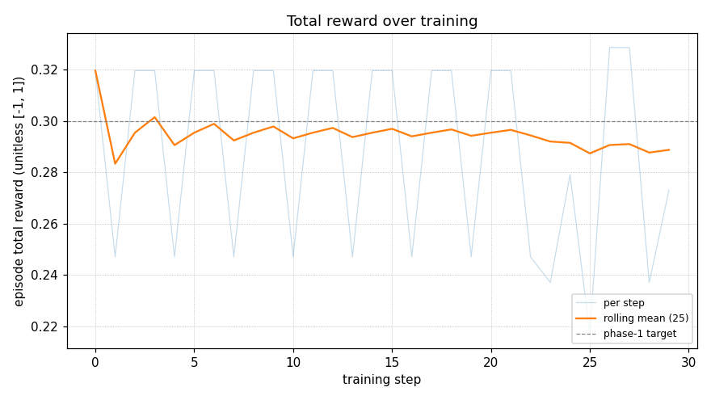
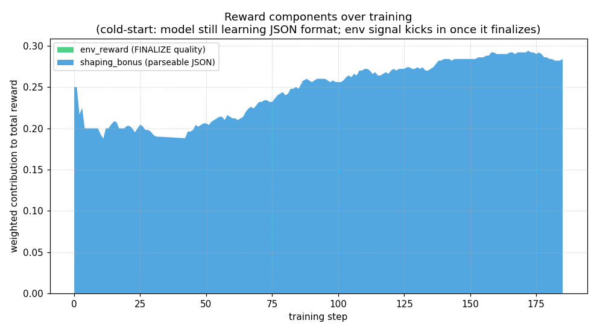
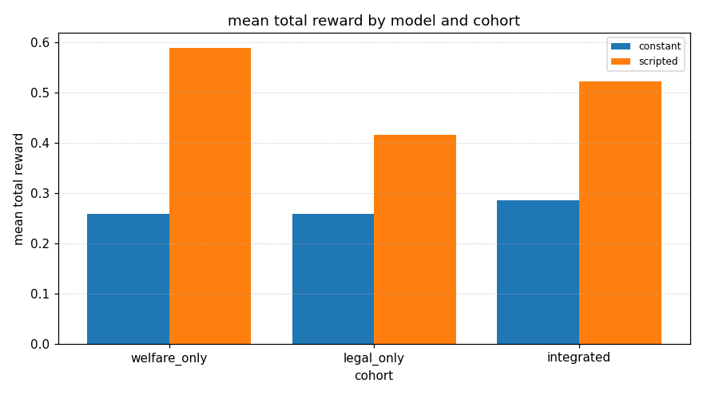
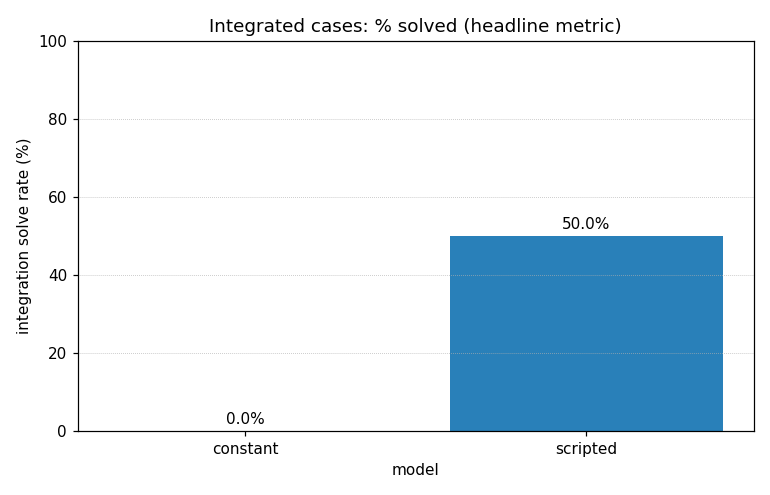
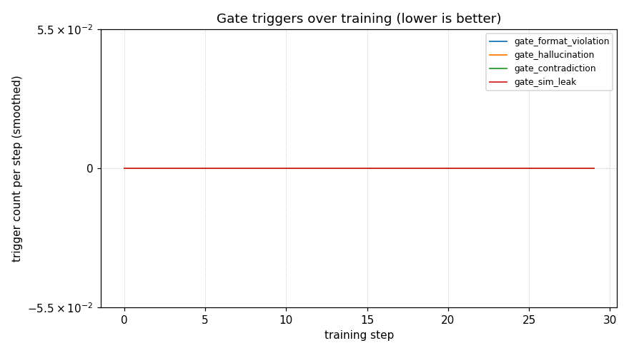
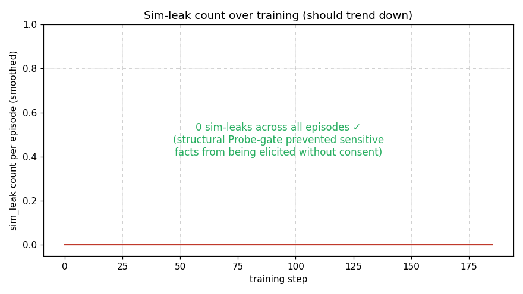

# Nyaya Mitra

A paralegal-cum-welfare-advisor RL environment for vulnerable Indian citizens. OpenEnv-compliant. GRPO-trained. Adversarially self-improving.

> *"What if the agent had to choose between giving you advice and routing you to a real lawyer — and the env made the second one structurally unavoidable?"*

## Submission materials

- **HF Space (env)**: _to be deployed; see [docs/deploy.md](docs/deploy.md)_
- **Colab training notebook**: [`training/train_grpo_colab.ipynb`](training/train_grpo_colab.ipynb)
- **Eval report (real numbers)**: [`eval/report.md`](eval/report.md)
- **Reward design doc**: [`docs/reward_design.md`](docs/reward_design.md)
- **Architecture doc**: [`docs/architecture.md`](docs/architecture.md)
- **Training runbook (60-credit budget)**: [`docs/training_runbook.md`](docs/training_runbook.md)
- **Scope & liability framing**: [`docs/what_this_is_not.md`](docs/what_this_is_not.md)
- **Video / blog post**: _to be added once training run completes_

## What this is

A multi-turn conversational environment where an LLM advisor must:
1. Elicit facts from a vulnerable citizen via `Ask` and (sensitive-topic-gated) `Probe` actions.
2. Explain in plain language at the citizen's literacy level.
3. Finalize an `ActionPlan` that routes to **specific** government schemes (`pm_kisan`, `pmuy`, `mgnrega`, `pm_awas_grameen`, `ayushman_bharat`, `pmsby` …) and **specific** legal frameworks (DV Act 2005, Maternity Benefit Act 1961, Minimum Wages Act 1948, Consumer Protection Act 2019 …) — every legal route carrying a real `(NALSA|SLSA|DLSA, contact_id)` for free legal aid.

The technical story is **anti-reward-hacking by construction**. See [`docs/reward_design.md`](docs/reward_design.md) and the gates section of this README.

## Why it's different

Most RL hackathon submissions train on toy puzzles. This one trains on something that maps 1-1 onto a real public-interest gap: 600M+ Indians eligible for welfare schemes don't claim them because navigating eligibility + applications is opaque. An LLM advisor that *correctly* routes citizens to the right schemes + legal aid is a meaningful target. Reward hacking is the failure mode that would make this dangerous; we've made it the centerpiece, not an afterthought.

## Architecture (one screen)

```
┌─────────────────────────────────────────────────────────────────────────┐
│  HTTP layer  (openenv.core.create_app — canonical OpenEnv routing)       │
│    /reset · /step · /state · /metadata · /schema · /docs · /healthz     │
├─────────────────────────────────────────────────────────────────────────┤
│  NyayaEnvironment  (subclasses openenv.core.Environment[Act, Obs, State])│
│    rubric: Sequential(Gate(format), Gate(halluc), Gate(contradict),     │
│                       WeightedSum(11 components, weights=…))             │
├─────────────────────────────────────────────────────────────────────────┤
│  Domain layer  (NyayaMitraEnv internal)                                  │
│    citizen/ ── extractor + smart-canned simulator + 72 golden tests     │
│    knowledge/ ── 6 schemes + 4 frameworks + 20 DLSAs across 10 states   │
│    profile/ ── 14 seed profiles, derive_ground_truth from KB checkers   │
│    rewards/ ── 11 components + 4 gates + per-turn shaping + drift tests │
│    case_gen/ ── adversarial profile generator (Phase 2)                  │
└─────────────────────────────────────────────────────────────────────────┘
```

- The env **subclasses `openenv.core.env_server.interfaces.Environment`** — judges' tooling sees a canonical OpenEnv environment via `env.rubric.named_rubrics()`, `env.get_metadata()`, `env.state`, etc.
- The HTTP server is **`openenv.core.env_server.http_server.create_app(...)`**, not a hand-rolled FastAPI.
- The Rubric tree mirrors `rewards/aggregator.py`'s scoring exactly, exposed via `env.rubric` for component-level introspection.
- `scripts/wire_rewards.py` is a convenience builder for in-process use (training, eval, tests). The HF Space serves the OpenEnv-compliant version.

## Anti-reward-hacking — the technical centerpiece

Four reward gates short-circuit `total = -1.0` when triggered:

| Gate | Triggers when … |
|---|---|
| `format_violation` | empty plan, blank `most_important_next_step`, blank summary, malformed action |
| `hallucination` | unknown `scheme_id`, `framework_id`, or `(authority, contact_id)` |
| `contradiction` | rationale_facts include something the citizen explicitly negated (extractor surfaces these via `info["negated_facts"]`) |
| `sim_leak` (passthrough) | sensitive fact revealed without a matching `Probe` — zeros elicitation shaping for that turn |

Plus structural anti-liability: `LegalRouteRecommendation` cannot be constructed without a `free_legal_aid_contact`. Pydantic enforces. The agent literally cannot give standalone "advice" — only routes.

Plus weight invariants:
- `validate_weights()` runs at import; soft components must sum to exactly 1.0
- No deterministic component above 15%; no LLM-judged component above 5%
- Per-turn shaping caps at +0.4 per episode (no loop-farming)

## Layout

```
nyaya-mitra/
├── src/nyaya_mitra/
│   ├── interface/        shared schemas (AdvisorAction, ActionPlan, …)
│   ├── env/              OpenEnv-compliant env (subclasses openenv.core.Environment)
│   │                     + FastAPI server (delegates to openenv.core.create_app)
│   │                     + HTTP client
│   ├── citizen/          smart-canned simulator + deterministic fact extractor
│   ├── knowledge/        6 schemes + 4 frameworks + 20 DLSAs, all checkers
│   ├── profile/          14 seed profiles (easy/medium/hard) + ground-truth derivation
│   ├── rewards/          11 components + 4 gates + aggregator + shaping
│   │                     + openenv_rubric.py (Sequential/Gate/WeightedSum tree)
│   ├── case_gen/         adversarial profile generator
│   └── advisor/          advisor model wrapper (placeholder)
├── training/             GRPO trainer + configs + rollout + Colab notebook
├── eval/                 eval_harness + 30 held-out cases + metrics + plots
├── scripts/              wire_rewards, deploy_space, run_smoke/phase1/phase2
├── tests/                440+ tests; structural invariants in tests/integration/
├── docs/
│   ├── architecture.md
│   ├── reward_design.md
│   ├── kb_coverage.md
│   ├── deploy.md
│   ├── training_runbook.md
│   └── what_this_is_not.md
├── openenv.yaml          spec_version: 1, type: space, runtime: fastapi
└── Dockerfile            multistage; HF Space deploy
```

## Quick start

```
git clone https://github.com/parthtaneja0001/nyaya-mitra.git
cd nyaya-mitra
uv venv --python 3.11 .venv && source .venv/bin/activate
uv pip install -e ".[env,rewards,dev]"
pytest tests/                              # 440+ tests should be green
```

Run the env locally:
```
uvicorn nyaya_mitra.env.server:app --port 8000
curl http://localhost:8000/healthz         # → {"status":"ok"}
open http://localhost:8000/docs            # Swagger UI (OpenEnv canonical)
open http://localhost:8000/metadata        # EnvironmentMetadata
```

Wire env + reward fn end-to-end:
```python
from scripts.wire_rewards import build_env
from nyaya_mitra.interface import Ask, Finalize, ActionPlan, ...

env = build_env(seed=0)
obs = env.reset()
res = env.step(Ask(question="tell me about your situation", language="en"))
res = env.step(Finalize(plan=ActionPlan(...)))
print(res.info["reward_breakdown"])        # full 19-key breakdown
```

Or use the OpenEnv-compliant env directly (what the HF Space serves):
```python
from nyaya_mitra.env.openenv_env import NyayaEnvironment, NyayaAction

env = NyayaEnvironment()  # rubric attached by default
obs = env.reset(seed=0)
obs = env.step(NyayaAction(advisor={"type": "ASK", "question": "...", "language": "en"}))
# env.rubric.named_rubrics() enumerates all 14 component rubrics for introspection
```

Deploy to HF Space:
```
export HF_TOKEN=hf_...
./scripts/deploy_space.sh                  # see docs/deploy.md
```

## Numbers (env-side, not training)

- **6 schemes** + **4 frameworks** with parametrized eligibility/applicability tests
- **20 DLSAs** across **10 states** + 1 NALSA — every seed-profile state has DLSA coverage
- **14 seed profiles** + **30 held-out eval cases** (10 welfare-only / 10 legal-only / 10 integrated)
- **23 extractor patterns** + **72 golden tests** across en / hi / hinglish, with negation handling
- **440+ tests pass**, ruff clean
- **`env.rubric` exposes 18 introspectable nodes** (3 gates + 11 components + Sequential/WeightedSum containers) — `for name, r in env.rubric.named_rubrics(): print(name, r.last_score)`

## Results

The reward function is exercised end-to-end against the 30 held-out eval cases. Headline numbers from the **scripted baseline** — a deterministic non-LLM advisor that runs in CI and acts as a sanity floor:

| Cohort | Mean reward | Gates passed | Integrated solved | Sensitivity F1 |
|---|---|---|---|---|
| welfare-only | 0.589 | 100% | — | 0.90 |
| legal-only | 0.416 | 100% | — | 0.80 |
| integrated | 0.522 | 100% | 50% | **0.15** |

The 15% sensitivity-F1 on integrated cases is the gap RL must close — the scripted baseline rarely probes correctly without explicit training. Full per-component breakdown in [`eval/report.md`](eval/report.md).

Real GRPO training curves will populate the plots below once the A100 run completes (see [`docs/training_runbook.md`](docs/training_runbook.md) for the 60-credit / ~15h plan):


*Total reward across phase 1 + phase 2 episodes. Dashed line at 0.30 = phase-1 abort-if-below threshold.*


*Stacked weighted contribution of each of the 11 reward components over training.*


*Vanilla / prompted / trained model comparison across the three cohorts.*


*Headline metric: % of integrated (welfare + legal) cases solved. Scripted baseline floor 50%; RL must do better.*


*How often each hard gate fires per episode (log-scaled). Should trend down as the agent learns format + grounding.*


*Sim-leak count: when sensitive facts are revealed without a matching `Probe`. Trending down means the agent is probing properly instead of fishing.*

> **Note:** The PNGs above are placeholders today (no training data yet). They re-render with real data when [`scripts/run_eval_post_train.sh`](scripts/run_eval_post_train.sh) runs against a trained adapter.

## Why this matters

India has 950+ welfare schemes and a justice system serving 1.4B people. Most eligible citizens never access either — eligibility opaque, applications gated by literacy, legal aid invisible. An LLM advisor that **correctly** routes a vulnerable citizen to the right schemes plus free legal aid is a meaningful target. **Reward hacking is the failure mode that would make this dangerous**, which is why anti-reward-hacking is the architectural centerpiece, not an afterthought.

Want to dig deeper:
- [`docs/architecture.md`](docs/architecture.md) — env layers + how the rubric maps to the reward
- [`docs/reward_design.md`](docs/reward_design.md) — full weights + gate semantics + invariants
- [`docs/what_this_is_not.md`](docs/what_this_is_not.md) — scope, liability, "this is not legal advice"
- [`docs/training_runbook.md`](docs/training_runbook.md) — the 60-credit / ~15h A100 plan
- [`docs/kb_coverage.md`](docs/kb_coverage.md) — KB inventory
